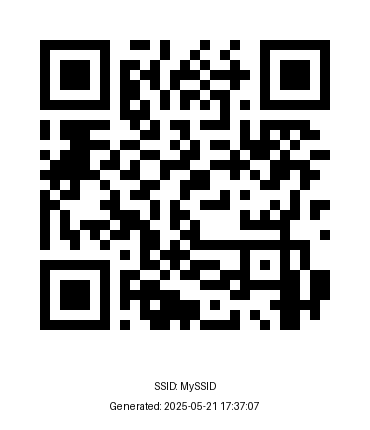

# WiFi QR Code Generator

This Python script generates a QR code image that can be scanned to quickly connect to a WiFi network. The QR code can include the SSID, password, and additional information such as the SSID name and generation timestamp below the QR code image.

## Features

- Prompts for SSID and password if not hardcoded.
- Supports WPA/WPA2/WPA3, WEP, or open networks.
- Optionally displays the SSID and generation date/time below the QR code.
- Prevents accidental overwriting of existing QR code images.
- Customizable output image file name.

## Requirements

Install dependencies with:

```sh
pip install -r requirements.txt
```

## Usage

Run the script:

```sh
python qrcode-generator.py
```

If you do not hardcode the SSID or password, you will be prompted to enter them.

## User-Editable Variables

At the top of [`qrcode-generator.py`](qrcode-generator.py), you can edit the following variables to customize the output:

| Variable              | Description                                                                                         | Example Value         |
|-----------------------|-----------------------------------------------------------------------------------------------------|----------------------|
| `output_ssid_png`     | If `True`, the SSID will be displayed as text below the QR code image.                              | `True` or `False`    |
| `output_datetime_png` | If `True`, the date/time of QR code generation will be displayed below the QR code image.           | `True` or `False`    |
| `encryption`          | WiFi encryption type. Use `"WPA"` for WPA/WPA2/WPA3 Personal, `"WEP"` for WEP, or `"nopass"` for open networks. | `"WPA"`              |
| `hidden`              | Set to `"true"` if the SSID is hidden, otherwise `"false"`. **Must be a string, case-sensitive.**   | `"false"`            |
| `output_file`         | The filename for the generated QR code image.                                                       | `"wifi_qr.png"`      |
| `ssid`                | The WiFi SSID. Leave as `""` to be prompted at runtime, or set to a string to hardcode.             | `"MySSID"`        |
| `wifi_psk`            | The WiFi password. Leave as `""` to be prompted at runtime, or set to a string to hardcode.         | `"QRCodeUserPass"`   |

**Note:**  
- If `ssid` or `wifi_psk` are left blank (`""`), you will be prompted to enter them when running the script.
- Passwords must be at least 8 characters long for WPA/WPA2/WPA3.

## Output

The script generates a PNG image (default: `wifi_qr.png`) containing the QR code. If enabled, the SSID and generation timestamp are displayed below the QR code.

## Example



## Disclaimer

This script is provided for educational and convenience purposes only. Use at your own risk. Sharing WiFi credentials via QR code may expose your network to unauthorized access. Always ensure you are complying with your organization's security policies and best practices. The authors and contributors are not responsible for any misuse or security issues resulting from the use of this script.
